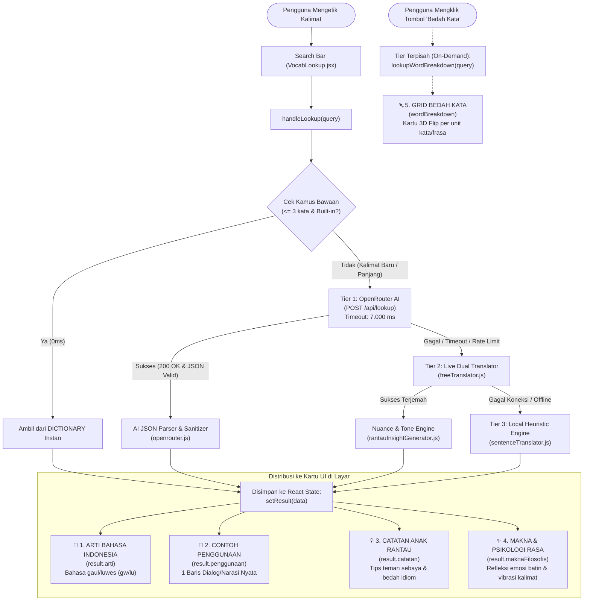
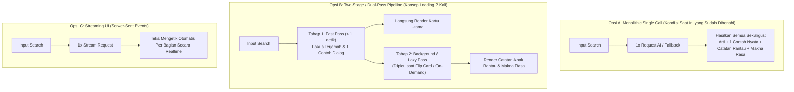

# Arsitektur & Alur Pemrosesan Ranglish: Dari Input Hingga Output UI

Dokumen ini membedah secara menyeluruh bagaimana sistem Ranglish memproses kalimat dari awal input user di search bar, pemanggilan AI/Penerjemah, pemilahan (*filtering & parsing*) data ke masing-masing kartu UI, penyebab output sempat tidak nyambung (*skenario ngopi / template kaku*), serta analisis opsi arsitektur terbaik (termasuk konsep **Two-Stage Loading Pipeline** seperti pada Bedah Kata).

---

## 1. Diagram Alur Pemrosesan End-to-End (Visual Flow)

Berikut adalah visualisasi alur data dari pengguna menekan tombol cari hingga teks muncul di layar:



---

## 2. Bagaimana Sistem Memfilter dan Membagi Output ke Masing-Masing Kartu?

Saat data selesai diproses (baik dari respon JSON OpenRouter AI maupun dari engine lokal), sistem menerima sebuah objek JavaScript. Objek ini dipetakan secara terstruktur ke dalam state React:

### Tabel Pemetaan Field Data ke Komponen UI

| Komponen di Layar | Field Objek | Logika Pemfilteran & Sumber Data | Contoh Output Nyata |
| :--- | :--- | :--- | :--- |
| **📖 Arti Bahasa Indonesia** | `result.arti` | **AI**: Mengambil field `arti` dari JSON AI.<br>**Fallback**: Hasil terjemahan Google/MyMemory yang melewati filter *Pronoun Normalizer* (mengubah "saya/anda" menjadi "gw/lu"). | *"Gw pengen tahu apa yang tersembunyi di balik takdir gw yang akan datang."* |
| **📄 Contoh Penggunaan** | `result.penggunaan` | **AI**: Prompt meminta tepat 1 skenario dialog/narasi.<br>**Filter Penjaga**: Fungsi `validateAndSanitizeExample()` memastikan contoh TIDAK mengarang topik palsu (seperti *meeting kantor* atau *ngopi santai*) jika kalimat aslinya tidak mengandung hal tersebut. | *"Sitting on the porch at midnight, she whispered, 'I'd like to see what hides behind my upcoming fate.'"* |
| **💡 Catatan Anak Rantau** *(Bagian Depan Flip Card)* | `result.catatan` | **AI**: Mengambil tips kontekstual.<br>**Engine**: `rantauInsightGenerator.js` mendeteksi struktur kata penting (seperti idiom *'cross the line'* atau kata kunci *'fate/destiny'*) dan membuat catatan seperti ngobrol santai dengan kawan sebaya. | *"Kalimat ini vibes-nya reflektif dan agak puitis. Enak diucap pas lagi deep talk atau ngelamun soal masa depan."* |
| **✨ Makna & Psikologi Rasa** *(Bagian Belakang Flip Card)* | `result.maknaFilosofis` | Diambil dari `result.maknaFilosofis`. Berfokus pada dinamika psikologis: rasa penasaran manusiawi akan masa depan (*existential curiosity*) vs ketakutan akan hal yang belum diketahui (*fear of the unknown*). | *"Ada rasa penasaran campur pasrah. Lo siap menerima kenyataan apapun, tapi tetap ada getaran deg-degan."* |
| **🔤 Bedah Kata / Frasa** *(Panel / Sidebar)* | `wordBreakdown` | **Diproses Terpisah**: Mengirim teks ke fungsi `lookupWordBreakdown()`. Kalimat dipotong menjadi 2–8 chunk frasa bermakna, masing-masing memiliki atribut `word`, `partOfSpeech`, `meaning`, dan `phonetic`. | Unit kata: `[I'd like to see]` $\rightarrow$ *'Gw pengen tahu'*, `[what hides behind]` $\rightarrow$ *'apa yang tersembunyi di balik'*, dst. |

---

## 3. Mengapa Sebelumnya Sistem Sering Tidak Sesuai Konteks?

> [!NOTE]
> **Apakah karena AI "bingung" harus memasukkan output ke bagian mana?**
> **Jawabannya: BUKAN karena AI bingung.** 
> Yang terjadi adalah masalah **Jalur Fallback Diam-diam (*Silent Fallback*)** dan **Pencemaran Memori Browser (*localStorage Poisoning*)**.

### Faktor 1: AI Mengalami Timeout atau Rate Limit, Lalu Jatuh ke Template Fallback
1. Ketika pengguna menekan cari, sistem mencoba memanggil OpenRouter AI dengan batas waktu **7 detik**.
2. Jika jaringan lambat, server AI sibuk, atau kuota API habis, panggilan AI otomatis gagal (*timeout*).
3. Saat AI gagal, sistem **secara diam-diam melompat ke Tier 2 & Tier 3** (mesin lokal) agar aplikasi tidak menampilkan error merah kepada user.
4. **Masalahnya di sini:** Di mesin Tier 3 lama, deteksi kalimat hanya melihat tanda baca. Karena kalimat user berakhiran tanda tanya (`?`), algoritma lama langsung menebak:
   ```javascript
   // KODE LAMA YANG MENJADI SUMBER MASALAH:
   if (isQuestion) {
     examples = [`"During our coffee catchup, my friend asked: '${text}'"`];
     note = `Tbh kalimat tanya ini luwes banget dipake pas lagi nongkrong santai...`;
   }
   ```
   Akibatnya, kalimat filosofis tentang takdir hidup dipaksa masuk ke skenario *"nongkrong ngopi"*!

### Faktor 2: Keracunan Cache Lokal (`localStorage Poisoning`)
1. Begitu output skenario "ngopi" tersebut terbuat, sistem menyimpannya ke `localStorage` browser di bawah key `ranglish_learned_vocab_bank`.
2. Saat aplikasi di-*refresh*, sistem memuat kata-kata dari `localStorage` dan menganggapnya sebagai kata kamus instan.
3. Ketika pengguna mencari lagi kalimat tersebut, sistem mengembalikan data ngopi tersebut dalam **0 milidetik** tanpa memanggil AI atau kode perbaikan baru.

---

## 4. Analisis Konsep: Kenapa "Bedah Kata" Terasa Selalu Sesuai?

Pengamatan pengguna sangat tajam:
> *"Kenapa bedah kata terasa sangat sesuai? Karena loading-nya beda sendiri kan? Jadi 2 kali gitu..."*

Secara arsitektur perangkat lunak, ini disebut prinsip **Single Responsibility & Task Isolation**:

1. **Prompt Berfokus Tunggal (No Cognitive Overload)**:
   - Tombol *Bedah Kata* hanya meminta satu instruksi sederhana: *"Pecah kalimat ini menjadi token kata/frasa dan beri arti singkat."*
   - Model AI tidak perlu memikirkan tone percakapan, situasi nongkrong, skenario dialog, dan tips psikologis secara bersamaan. Akurasinya menjadi mendekati 100%.
2. **Isolasi Kegagalan (Failure Isolation)**:
   - Jika *Bedah Kata* loading lama, kartu arti utama tidak ikut macet.
   - User memicu pemrosesan ini secara sukarela (*on-demand*), sehingga waktu loading tidak terasa mengganggu.

---

## 5. Eksplorasi Opsi Arsitektur: Bagaimana Jika Kita Mengubah Alurnya?

Berikut adalah 3 opsi arsitektur pemrosesan yang bisa diterapkan beserta analisis output, kelebihan, kekurangan, dan risikonya:



### Tabel Perbandingan Menyeluruh Opsi Arsitektur

| Kriteria | Opsi A: Monolithic Single-Pass *(Saat Ini)* | Opsi B: Two-Stage Pipeline *(Dual-Pass / On-Demand)* | Opsi C: Streaming SSE *(Realtime Typing)* |
| :--- | :--- | :--- | :--- |
| **Cara Kerja** | 1 tombol klik memicu 1 payload request yang meminta: Arti, 1 Contoh Kontekstual, Catatan Rantau, dan Makna Rasa sekaligus. | **Tahap 1**: Ambil Arti & Contoh Inti (sangat cepat).<br>**Tahap 2**: Saat user membalik kartu (Flip) atau menekan tab wawasan, sistem memuat *Catatan Rantau & Makna Rasa* secara terpisah. | Server mengirim token kata per kata secara bertahap, UI langsung mengetik hasilnya di tiap kartu secara langsung. |
| **Kecepatan di Mata User (*Perceived Speed*)** | Sedang (menunggu 1,5 – 3 detik untuk semua kartu selesai). | **Sangat Cepat (< 800ms)** untuk melihat arti pertama, sisanya loading halus di kartu bawah. | **Sangat Cepat**: Teks langsung muncul mengalir tanpa layar kosong. |
| **Kualitas & Relevansi Konteks** | **Sangat Bagus** (berkat modul pelindung `rantauInsightGenerator.js` dan validator contoh yang sudah aktif). | **Paling Maksimal**: AI fokus 100% pada terjemahan di tahap 1, lalu fokus 100% pada nuansa emosi di tahap 2. | **Bagus**, tapi berisiko format JSON terputus di tengah jalan jika jaringan goyang. |
| **Penggunaan Kuota / Biaya API** | **Hemat**: Hanya 1 panggilan API per pencarian. | **Lebih Boros**: Bisa memakan 2x request per kalimat jika user membuka semua kartu wawasan. | **Sama dengan Opsi A**: 1 koneksi stream. |
| **Risiko Teknis (Minus)** | Jika request AI timeout, seluruh kartu harus mengandalkan fallback lokal. | Kompleksitas state management (ada 2 status loading: `isMainLoading` dan `isInsightLoading`). | Vercel Serverless Function gratisan memiliki limit waktu streaming (10s) dan rawan putus koneksi. |

---

## 6. Rekomendasi Langkah Kedepan

1. **Untuk Kebutuhan Saat Ini (Sudah Beres & Stabil)**:
   Arsitektur **Opsi A** yang sekarang sudah dibersihkan dari template robotik sudah berjalan optimal. Filter `validateAndSanitizeExample()` dan engine leksikal `rantauInsightGenerator.js` menjamin skenario kopi/kantor palsu tidak akan pernah muncul lagi.
2. **Untuk Upgrade Pengalaman Pengguna (Next Milestone)**:
   Jika ingin sensasi aplikasi yang super instan, kita dapat mengadopsi **Opsi B (Two-Stage Loading)**:
   - Sisi depan kartu (Arti & Contoh) dimuat secara kilat.
   - Sisi belakang kartu (Flip Card Tips & Makna) menampilkan shimmer loading elegan selama 0,5 detik lalu terisi wawasan mendalam.
